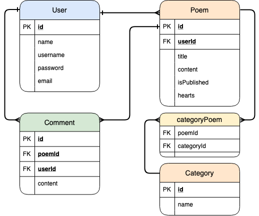

# ga-wdi23-project-1

General Assembly Web Development Immersive - Project 2

# Pluma Poetry Writing App

## Carlo Bruno | General Assembly Web Development Immersive

### Project \#2 Full Stack Application - Node.js Express.js PostgreSQL

[LIVE DEMO](https://evening-refuge-40821.herokuapp.com/welcome)

## Table of Contents

- [Introduction](#introduction)
- [Building the App](#building-the-app)
- [Built With](#built-with)

## Introduction

A full-stack poetry blog site that helps poets write their next masterpiece. Pluma provides easily accessible writing tools, allows users to publish their work, and fosters a community of writers online.

### Project Specification

This is Portfolio Project 2 of General Assembly Web Development Immersive. The goal is to create a Full-Stack Web App of our chosing. The database is created using PostgreSQL and Sequelize. The back-end of the site was implemented using Node.js and Express and data is communicated using EJS. Data in the front-end are queried from DataMuse API using Fetch.

### Technical Requirements
- Have at least 2 models (more if they make sense) -- ideally a user model and one that represents the main functional idea for your app
- Include sign up/log in functionality, with hashed passwords & an authorization flow
- Incorporate at least one API. Examples include Yelp, Tumblr, Facebook, and others on Mashape.
- Have complete RESTful routes for at least one of your resources with GET, POST, PUT, and DELETE
- Utilize an ORM to create a database table structure and interact with your relationally-stored data
- Include wireframes that you designed during the planning process
- Have semantically clean HTML and CSS
- Be deployed online and accessible to the public

#### Pluma Writer Screenshot

## Building the App

<!-- I started by creating the model diagrams. I designed a few models and kept it simple and straightforward. -->

### Models and Entity Relations 

### Future Implementation

One writing tool that I intend to add is a D3 visualization for trigger words. The idea is to have a user input a word (trigger), and the writing tool will display nodes of words related to it, their size corresponding to their correlation. I have the infrastructure coded into the app (commented out), but alas, my knowledge of D3 and manipulating SVG's are lacking at the time of this writing.

#### Disclaimer, Credits:

## Built with

- [DataMuse API](https://www.datamuse.com/api/)
- Google Fonts [Dancing Script](https://fonts.google.com/specimen/Dancing+Script),
[Special Elite](https://fonts.google.com/specimen/Dancing+Script) & 
[Lato](https://fonts.google.com/specimen/Lato)
- [FontAwesome Icons](https://fontawesome.com/)

- ER Diagram

### Tutorials, Ideas and Inspiration

